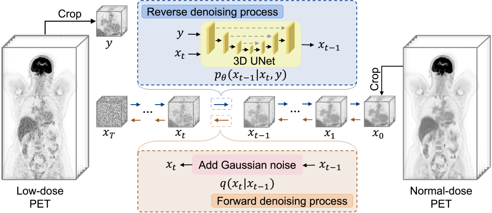
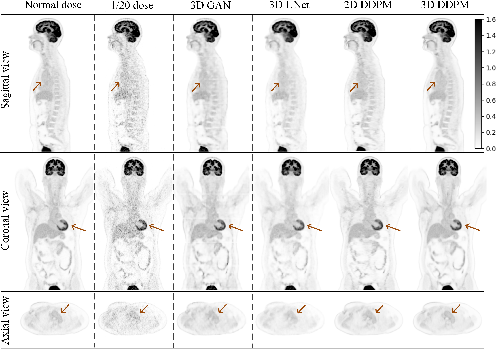

<h2 align="center">Robust Whole-body PET Image Denoising Using 3D Diffusion Models: Evaluation Across Various Scanners, Tracers, and Dose Levels</h2>

  
    Boxiao Yu1,
  
   Savas Ozdemir2,
  
    Yafei Dong3,
  
    Wei Shao4,
  
    Tinsu Pan5,
  
    Kuangyu Shi6,
  
    Kuang Gong1

  1J. Crayton Pruitt Family Department of Biomedical Engineering, 
     University of Florida;
  2Department of Raiology, University of Florida;
  3Yale School of Medicine, Yale University;
  4Department of Medicine, University of Florida;
  5Department of Imaging Physics, University of Texas MD Anderson Cancer Center;
  6Department of Nuclear Medicine, University of Bern

## Purpose

Whole-body PET imaging plays an essential role in cancer diagnosis and treatment but suffers from low image quality. Traditional deep learning-based denoising methods work well for a specific acquisition but are less effective in handling diverse PET protocols. In this study, we proposed and validated a 3D Denoising Diffusion Probabilistic Model (3D DDPM) as a robust and universal solution for whole-body PET image denoising. 

## Method

  

The proposed 3D DDPM gradually injected noise into the images during the forward diffusion phase, allowing the model to learn to reconstruct the clean data during the reverse diffusion process. A 3D convolutional network was trained using high-quality data from the Biograph Vision Quadra PET/CT scanner to generate the score function, enabling the model to capture accurate PET distribution information extracted from the total-body datasets. The trained 3D DDPM was evaluated on datasets from four scanners, four tracer types, and six dose levels representing a broad spectrum of clinical scenarios.

## Result

  

The proposed 3D DDPM consistently outperformed 2D DDPM, 3D UNet, and 3D GAN, demonstrating its superior denoising performance across all tested conditions. Additionally, the model’s uncertainty maps exhibited lower variance, reflecting its higher confidence in its outputs.  

## Installation
### Step 1: Clone the Repository

    git clone https://github.com/Miche11eU/PET-Image-Denoising-Using-3D-Diffusion-Model.git
    cd PET-Image-Denoising-Using-3D-Diffusion-Model

### Step 2: Create and activate the conda environment from the environment.yml file:

    conda env create -f environment.yml
    conda activate PET-3D-DDPM

### Step 3: Download Pre-trained Models
Download the pre-trained model files and place them into the `./checkpoint/` folder.

## Testing

### Data Preparation

Before running the denoising script, modify the `load_data_for_worker` function in `./scripts/test.py` to align with your data format and dimensions. This function is responsible for loading your low-dose PET data into the model.

### Running the Denoising Script

We provide a shell script `test_DDPM_3d_mpi.sh` to facilitate the testing process.

#### Usage

- `--base_samples`: Path to the `.npz` files containing your low-dose PET images.
- `--num_samples`: Total number of samples you wish to process.
- `-n`: Number of GPUs to utilize for parallel processing.
- `--save_dir`: Path to the directory where you want to save the denoised images.

## Contact

For any questions or inquiries, please contact boxiao.yu@ufl.edu.

